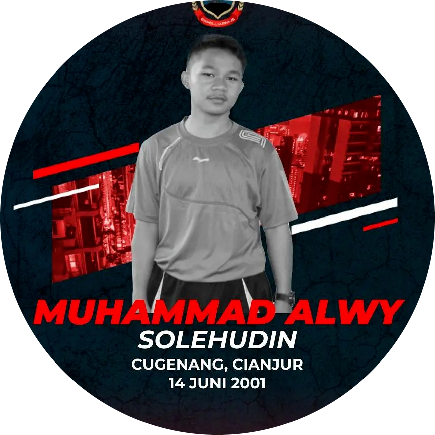

# M-cif

# Our Team

 

 
    
    [Teknik Informatika](http://if.uinsgd.ac.id/) [UIN Sunan Gunung Djati Bandung](https://uinsgd.ac.id/) 

## Latar Belakang Masalah
Aplikasi M-cif merupakan aplikasi yang digunakan untuk membantu individu atau kelompok dalam mengelola keuangan pribadi atau bisnis. Aplikasi keuangan bisa mencakup berbagai fitur seperti pengelolaan budget, pemantauan pengeluaran, pemantauan pemasukan, dan membuat diagram pengeluaran, dengan adanya aplikasi M-cif semua informasi dapat disimpan dan dikelola secara terintegrasi, sehingga memudahkan pengelolaan keuangan.

Aplikasi M-cif juga bisa memberikan banyak keuntungan bagi penggunanya, seperti membantu mengatur budget dengan lebih baik, mengelola pengeluaran secara efektif, memberikan laporan keuangan yang akurat dan memberikan diagram pengeluaran sehingga membantu individu atau kelompok untuk lebih memahami keuangan mereka dan mengambil keputusan yang tepat.

## Identifikasi Masalah
1. Kesalahan dalam mengisi atau mencatat transaksi,
2. tidak adanya laporan keuangan,
3. Kurangnya pemahaman nilai mata uang.

## Solusi yang Ditawarkan 
1. Mengatur budget dengan lebih baik: Aplikasi M-cif bisa membantu kita dalam menentukan pemasukan dan pengeluaran yang tepat sesuai dengan kebutuhan dan tujuan keuangan,
2. Memberikan laporan keuangan yang akurat: Aplikasi M-cif bisa memberikan laporan yang menyajikan informasi keuangan secara terstruktur dan mudah dipahami, sehingga kita bisa lebih mudah memahami keuangan kita dan mengambil keputusan yang tepat.
3. Mempermudah pemahaman harga barang atau jasa dalam mata uang yang berbeda dan juga mempermudah transaksi internasional.
## Target User
yang kita tuju adalah orang-orang yang mengerti dan mengapresiasi sebuah rencana keuangan, bila dilihat dari kelompok orangnya sendiri itu termasuk, mahasiswa, orang yang baru masuk dunia kerja dan baru mendapatkan penghasilan sendiri, dan juga pekerja.

## Fitur
1. record pemasukan dan pengeluaran
2. visualisasi berupa diagram
3. Menampilkan Nilai Rupiah

## Pitch Deck
Pitch deck Kelompok 3 dapat dilihat pada link berikut [Pitch Deck](https://pitch.com/public/c4c6de3c-c0ca-42fa-be5f-0f1525303888/5b3e8e57-f18b-4cf8-aa45-919f3295d2d4)

## Medium
Medium Kelompok 3 dapat dilihat pada link berikut [Medium](https://medium.com/@1207050066/m-cif-application-dc9ae7efecf1)
