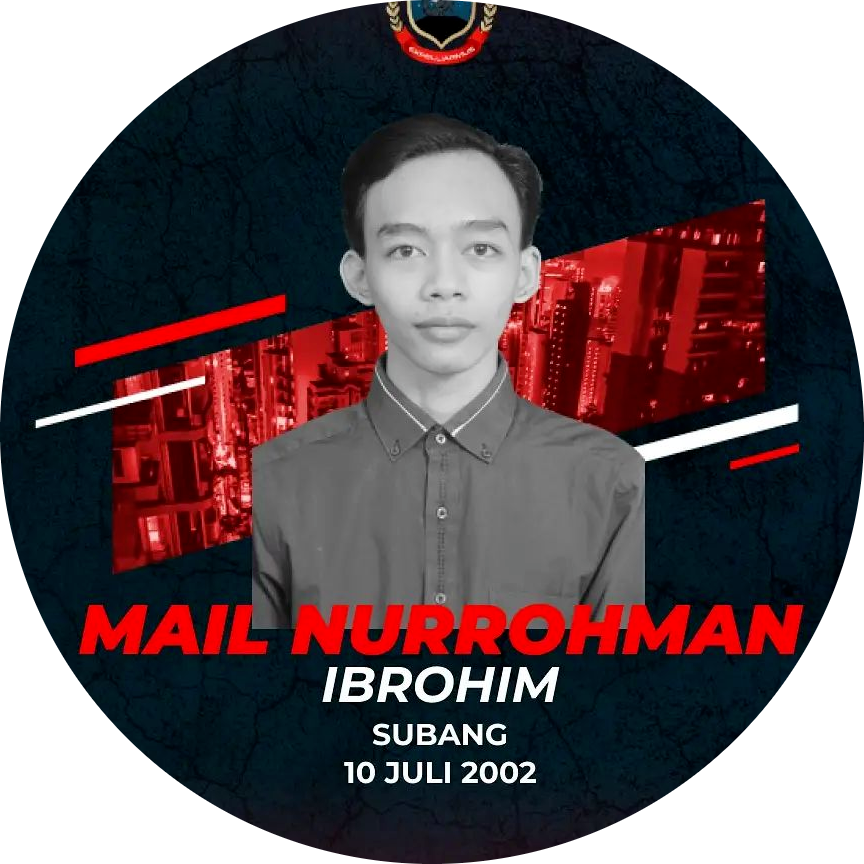
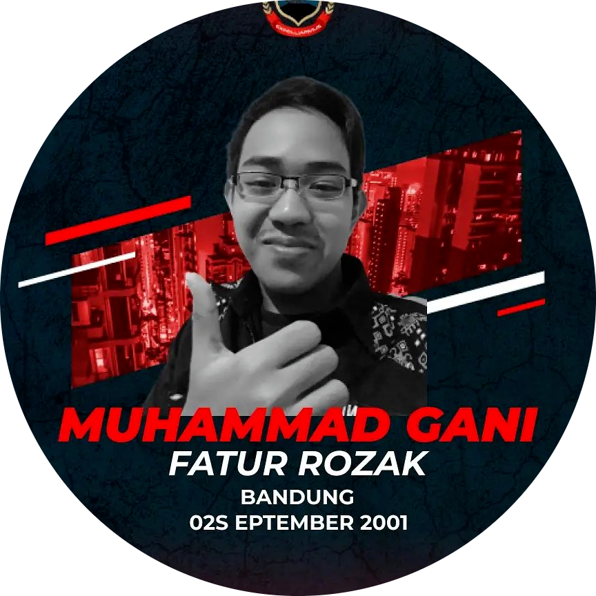

# M-cif

# Our Team

 

 
    
    [Teknik Informatika](http://if.uinsgd.ac.id/) [UIN Sunan Gunung Djati Bandung](https://uinsgd.ac.id/) 

## Latar Belakang Masalah
Aplikasi M-cif merupakan aplikasi yang digunakan untuk membantu individu atau kelompok dalam mengelola keuangan pribadi atau bisnis. Aplikasi keuangan bisa mencakup berbagai fitur seperti pengelolaan budget, pemantauan pengeluaran, pemantauan pemasukan, dan membuat diagram pengeluaran, dengan adanya aplikasi M-cif semua informasi dapat disimpan dan dikelola secara terintegrasi, sehingga memudahkan pengelolaan keuangan.

Aplikasi M-cif juga bisa memberikan banyak keuntungan bagi penggunanya, seperti membantu mengatur budget dengan lebih baik, mengelola pengeluaran secara efektif, dan memberikan laporan keuangan yang akurat. Aplikasi keuangan juga bisa memberikan notifikasi atau alert terkait transaksi atau pengeluaran yang dilakukan, sehingga membantu individu atau kelompok untuk lebih memahami keuangan mereka dan mengambil keputusan yang tepat.

## Identifikasi Masalah
1.  Kurangnya motivasi untuk belajar: Mahasiswa yang sering lupa tugas mungkin kurang motivasi untuk belajar atau tidak memahami pentingnya tugas yang diberikan.
2.  Kurangnya organisasi: Mahasiswa yang tidak terorganisir dengan baik mungkin kesulitan mengingat semua tugas yang harus dilakukan dan kapan harus diselesaikan.
3.  Distraksi lingkungan: Mahasiswa mungkin mudah terdistraksi oleh lingkungan sekitar, seperti perangkat elektronik atau aktivitas sosial, yang menyebabkan mereka lupa tugas.
4.  Masalah kesehatan: Mahasiswa yang sakit atau mengalami masalah kesehatan mungkin kesulitan untuk fokus pada belajar dan mengingat tugas.
5.  Stres: Mahasiswa yang mengalami stres akademik atau masalah pribadi mungkin kesulitan untuk fokus pada belajar dan mengingat tugas.

## Solusi yang Ditawarkan 
Solusi yang kami tawarkan untuk mengatasi masalah ini yaitu, dengan membuat aplikasi mobile berbasis android yang bernama Tugas GO. Aplikasi ini dapat digunakan untuk mempermudah mahasiswa mengisi absen serta informasi tugas-tugas dalam bentuk catatan.

## Target User
Aplikasi ini ditujukan kepada mahasiswa yang sering lupa absen dan lupa tugas.

## Fitur
1.  Membuat dan menyimpan catatan
2.  Memberikan informasi mata kuliah
3.  Memberikan nontifikasi absen
4.  File E-Library

## Pitch Deck
Pitch deck Kelompok 2 dapat dilihat pada link berikut [Pitch Deck](https://pitch.com/public/6cb4f7d9-7a2c-4c19-837f-08dc6fe1385c)
